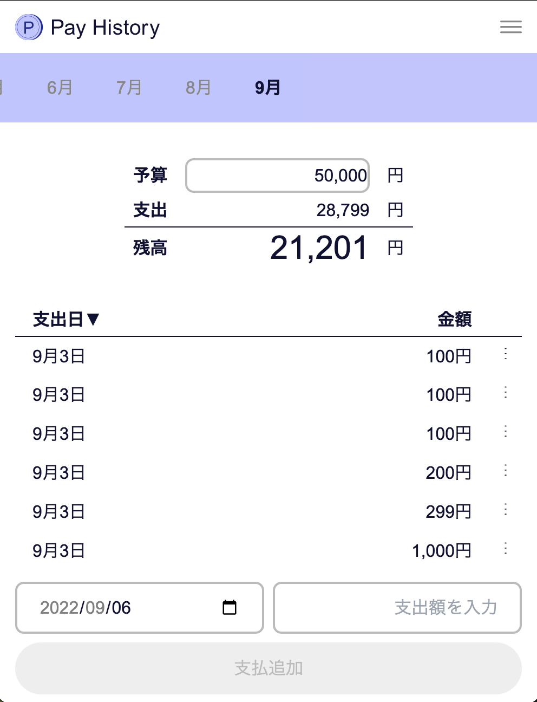

# Pay History

支出管理ツール

## URL

[https://pay-history.kanaru.jp](https://pay-history.kanaru.jp)

## 説明

### 解決する課題

高機能な家計簿アプリは、連携しているクレジットカードの支払いデータが反映されるまでに 1 週間以上の時間差があり、今月あといくら使っていいのかが分かりにくい。

### 作ったもの

支出するたびに金額を入力して残りいくら使えるのかを確認できるという web アプリ。既存の高機能な家計簿アプリと併用して使うことを想定しているため、できるだけ機能を絞ってシンプルに。支出するたびに入力するので、できるだけ簡単に入力できるように設計した。

### こだわり 1

自動的に匿名認証がかかり、アカウントが無くても予算管理を始められる。別のデバイスでもデータにアクセスしたい場合は後からメール,パスワード認証にアップグレード可能。

### こだわり 2

日常的に使うツールであるため、PWA に対応しておりネイティブアプリのようにインストールが可能。

## 使い方

1. 月の予算を入力する
2. 支払いしたらアプリで金額を入力
3. 完了!

## 使用技術

- Firebase
- NextJS
- TypeScript
- TailwindCSS

## 機能

- 月の予算設定
- 支払いデータ追加
- 支払いデータを支払日、金額でソート
- 予算残高計算
- 匿名認証 / アカウント作成 / ログイン / ログアウト
- パスワード変更 / 再設定

## サイトマップ

- /
  - /my
    - /change-password
  - /signin
  - /signup
  - /reset-password

## Firestore のデータモデル

- users
  - 'docId-01'
    - atCreated: timestamp
    - atUpdated: timestamp
    - budget: number (ユーザーが前回設定した予算)
    - email: string
    - isAnonymous: boolean (匿名ログイン判定)
    - monthlyData: sub collectionn (月次データ)
      - '2022-8'
        - atCreated: timestamp
        - atUpdated: timestamp
        - budget: number (その月固有のの予算)
        - payments: array (支払いデータの配列)
          - 0
            - atCreated: timestamp
            - atUpdated: timestamp
            - atPaied: timestamp (支払日)
            - price: number (支払金額)

支払いデータ(payments)を sub collection ではなく、array にすることで、ドキュメントの読み取り回数を減らし、コストを最適化しています。
