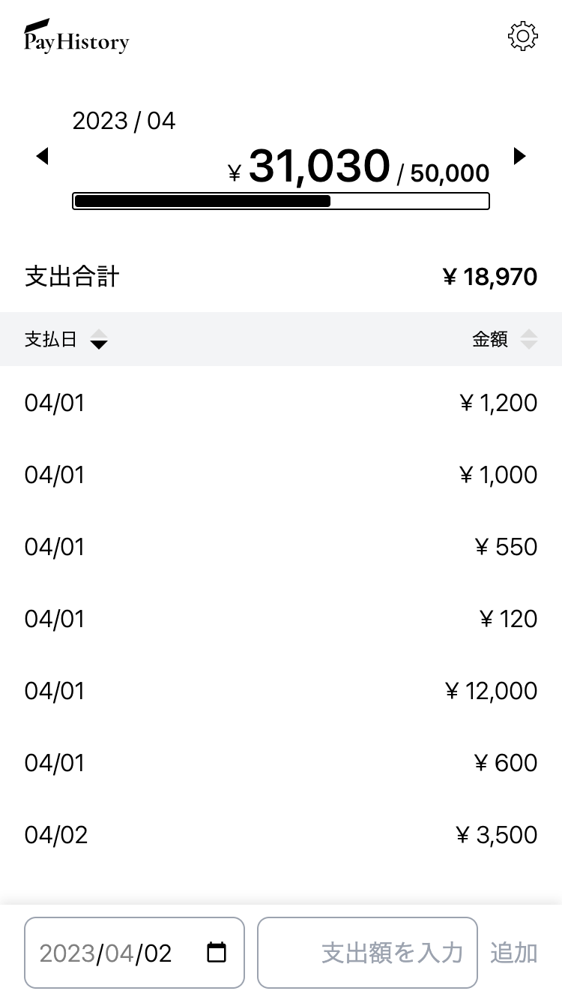

# Pay History

financial management tool of in a household.

## URL

[https://pay-history.kanaru.jp](https://pay-history.kanaru.jp)

## Description

### Problem

There is a time lag of more than a week before the payment data of the linked credit card is reflected in the high-performance household account book app, and it is difficult to know how much money can be used for the rest of the month.

高機能な家計簿アプリは、連携しているクレジットカードの支払いデータが反映されるまでに 1 週間以上の時間差があり、今月あといくら使っていいのかが分かりにくい。

### Product

A web application that allows you to check how much you can use remaining by entering the amount each time you spend. Since it is supposed to be used in conjunction with the existing high-performance household account book app, it will be simple with as few functions as possible. It was designed to be as easy as possible to enter because it is entered every time you spend.

支出するたびに金額を入力して残りいくら使えるのかを確認できるという web アプリ。既存の高機能な家計簿アプリと併用して使うことを想定しているため、できるだけ機能を絞ってシンプルに。支出するたびに入力するので、できるだけ簡単に入力できるように設計した。

### Point 1

Anonymous authentication is automatically applied, and budget management can be started without an account. You can later upgrade to email and password authentication if you want to access your data on another device.

自動的に匿名認証がかかり、アカウントが無くても予算管理を始められる。別のデバイスでもデータにアクセスしたい場合は後からメール,パスワード認証にアップグレード可能。

### Point 2

Since it is a tool that you use on a daily basis, it supports PWA and can be installed like a native app.

日常的に使うツールであるため、PWA に対応しておりネイティブアプリのようにインストールが可能。

## How To Use

1. Enter monthly budget.
2. When you make a payment, enter the amount in this app.
3. Complete!

## Technology

- Firebase
- NextJS
- TypeScript
- TailwindCSS

## Functions

- Set monthly budget
- Add payment data
- Sort payment data by payment date and amount
- Budget remaining calculation
- Anonymous authentication / create account / login / logout
- Change / reset password

## Site Map

- /
  - /landing-page
  - /sign-in
  - /sign-up
  - /change-password
  - /reset-password
    - /send-link
    - /set-new

## FireStore Data Model

- users
  - 'docId-01'
    - atCreated: timestamp
    - atUpdated: timestamp
    - budget: number
    - email: string
    - isAnonymous: boolean
    - monthlyData: sub collection
      - '2022-08'
        - atCreated: timestamp
        - atUpdated: timestamp
        - budget: number
        - payments: array
          - 0
            - atCreated: timestamp
            - atUpdated: timestamp
            - atPaid: timestamp
            - price: number

By making the payment data an array instead of a sub collection, I reduce the number of document reads and optimize costs.
